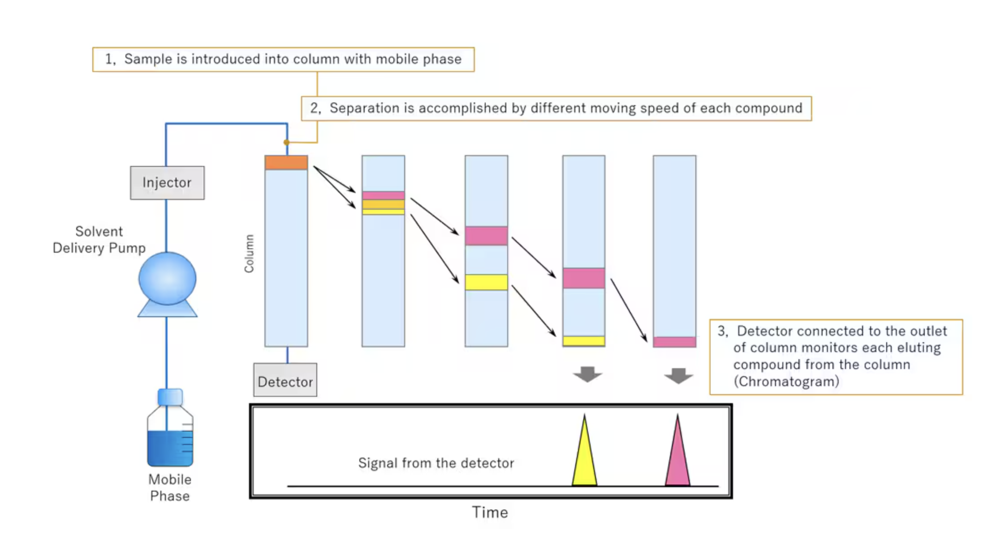
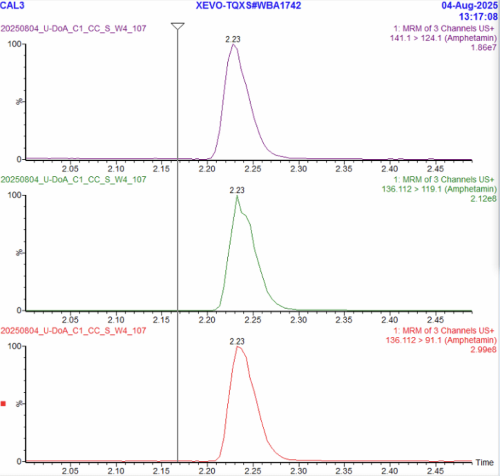

# 📖 Case & Background  

The methods developed in our laboratory are tailored for **workplace drug testing**, with three distinct analytical approaches designed to address different business needs: **U-DoA, Q-DoA, and OF-DoA**. The purpose of these tests is to determine whether a donor’s biological sample contains one or more prohibited substances that could impair performance or pose safety risks in the workplace. Each sample is screened for multiple analytes simultaneously.  

A **negative result** means that none of the target analytes are detected above the established cutoff levels, whereas a **positive result** indicates that at least one analyte is present at a concentration higher than its threshold.  

### Standard Workflow  
1. Donor samples are collected using specialized collection kits for saliva (Q-DoA and OF-DoA) or urine (U-DoA).  
2. The samples are transported to the laboratory for analysis using **LC-MS/MS (Liquid Chromatography with Tandem Mass Spectrometry)**.  
3. The LC-MS/MS instrument generates detailed measurements based on the method setup.  
4. These results are compiled and presented to a trained technician, who reviews the data and determines whether the sample should be classified as positive or negative.  

This manual evaluation is time-intensive, as the technician must carefully interpret the LC-MS/MS output to confirm whether any analytes exceed the required thresholds. The objective of this project is to **develop a predictive model that can automate this interpretation**, increasing efficiency while maintaining accuracy.  

To fully understand the work done by the technician when evaluating results, it is essential to first explain how LC-MS/MS operates. This technical background will also serve as the foundation for selecting suitable **data preprocessing methods** for the predictive model.

# 🔬 LC-MS/MS  

**LC-MS/MS (Liquid Chromatography–Tandem Mass Spectrometry)** is a powerful analytical technique used to separate, identify, and quantify molecules—particularly in complex biological samples such as blood, urine, or tissue.  

To help you succeed in this hackathon and achieve the best possible results, we will provide a clear explanation of how the LC-MS/MS method works.  

LC-MS/MS combines two distinct processes:  

- **Liquid Chromatography (LC)** → separates compounds in a mixture based on their chemical properties.  
- **Tandem Mass Spectrometry (MS/MS)** → identifies and quantifies molecules based on their *mass-to-charge ratio (m/z)*.  

In the following sections, we will describe each of these processes in detail and show how the data they generate are used to identify analytes and determine their concentration.  

### ⚗️ Liquid Chromatography

Liquid Chromatography is the first phase of the LC-MS/MS process. It is a separation technique where molecules in a biological sample are separated based on their chemical properties before mass spectrometry analysis.

In this method, the liquid mobile phase, which contains the patient sample, flows through the stationary phase—typically a packed column. As the sample moves through the column, each compound travels at a different speed depending on its chemical affinity for either the mobile or stationary phase. These affinities are determined by the molecule’s properties, such as *polarity*, *charge*, or *size*.

Because each compound interacts uniquely with the column, they **elute** (exit) at different times. However, the same molecule will consistently elute at the same time, provided the method is consistent. This predictable elution time is referred to as the **retention time**, and for many analytes in our method, the elution window is around **30 seconds**.

In practice, compounds with the same identity will form **peaks** at the same retention time, within a small acceptable variation—typically ±0.1 seconds—which helps confirm their identity with high confidence.

> **Goal:** Separate molecules in time, so they don’t all enter the mass spectrometer at once, but rather in small, organized groups, where each molecule elutes with its own kind, resulting in clearer, more interpretable signals.

<strong>Figure 1.</strong> In this diagram, the compound with lower affinity for the stationary phase—illustrated in yellow—elutes earlier than the compound with stronger interactions (pink), resulting in distinct retention times.

### 🔍 Tandem Mass Spectrometry (MS/MS)

Tandem Mass Spectrometry in LC-MS/MS typically uses a triple quadrupole instrument, consisting of three quadrupoles: **Q1**, **Q2**, and **Q3**. It is called tandem MS because the ions are filtered twice—once in Q1 and again in Q3.

#### Steps of the Method

- **Ionization**  
  Each compound is ionized by gaining or losing a proton or electron, enabling it to carry a charge. This is necessary because mass spectrometry manipulates charged particles using electric and magnetic fields, and neutral molecules cannot be detected.

- **Q1 (Precursor Ion Selection)**  
  The first quadrupole filters ions based on their mass-to-charge ratio (\(m/z\)), selecting only the compound of interest. This selected ion is called the **precursor ion** because it will be fragmented in the next step.

- **Q2 (Collision-Induced Dissociation, CID)**  
  The precursor ion collides with an inert gas, causing it to fragment into smaller pieces. These fragment ions result from predictable breakages, and each precursor-to-fragment ion transition is represented by the molecular weight of the precursor ion followed by that of the fragment ion (e.g., 141.1 > 124.1).

- **Q3 (Fragment Ion Selection)**  
  The third quadrupole filters the fragment ions based on their \(m/z\), selecting those of interest. Most compounds show two main fragment ions, but this may vary depending on fragment stability and method setup.

- **Detection**  
  The detector counts the number of fragment ions that pass through Q3, converting these counts into an electrical signal. This signal is recorded in real time, producing a chromatogram that represents the ion abundance over time.

This sequential filtering and fragmentation process provides high specificity and sensitivity, allowing accurate identification and quantification of compounds within complex biological samples. 

Think of it as having almost no chance of measuring intensity from another analyte that is not the analyte of interest—one that would elute at exactly the same time, have the same mass-to-charge ratio (Q1), and then under external forces (Q2) fragment into two ions with the exact same mass-to-charge ratios (Q3). This level of specificity effectively eliminates interference from other compounds, ensuring reliable and precise measurements.

<strong>Figure 2.</strong> Example chromatogram showing relative abundance of detected ions over retention time.

#### Chromatogram and Relative Abundance  

A chromatogram displays the **relative abundance** of ions over time. For each ion (fragment), a separate intensity graph is generated. The Y-axis of each graph shows the signal intensity normalized individually to that ion’s most intense peak, which is scaled to 100%.  

This per-ion normalization allows clear visualization of all fragments, especially since many compounds produce one dominant fragment ion (often near 90% relative abundance) alongside several lesser-abundant fragments that might otherwise be difficult to detect.  

> **Note:** This type of graph is called a **Chromatogram** because the time component arises from the prior chromatographic separation.  
> Instead of visual detection (such as the color-based detection in Figure 1.), here we use mass spectrometry to identify compounds based on their mass-to-charge ratio.

__

## 2. Chemical Compounds and Samples

This is how each instrument works individually, and now we will explain in more detail how the method is set up for our case when the problem involves identifying 40 compounds.

Full LC-MS/MS requires additional chemical components beyond the donor sample:

- **IS - Internal Standard**  
  The **internal standard** is an **isotope-labeled version** of the analyte of interest. It has the same chemical properties but a **slightly higher molecular weight** due to the replacement of some atoms with heavier isotopes—for example, hydrogen (¹H) replaced by **deuterium (²H)**.  
  Most IS compounds are **D5-labeled**, meaning five hydrogen atoms have been replaced with deuterium. Since the IS shares chemical properties with the analyte, it elutes at the same time, but the mass spectrometer distinguishes them based on their **molecular weight differences**. Internal standards are **not naturally present** in biological samples and are manufactured as **pure, stable compounds in certified laboratories**, ensuring they do not overlap with analytes of interest.

- **Calibrator (External Standard)**  
  A **certified standard** of the analyte, provided as a powder or solution, used for quantification by creating calibration curves. It is **chemically identical** to the analyte of interest to ensure accurate and reliable measurement.

- **Blank Matrix**  
  A **blank matrix** is a biological material (such as blood, plasma, serum, urine, etc.) that is **the same type of biological matrix as the patient samples**, but is confirmed to be free of the analytes of interest.

### Sample Types Used in LC-MS/MS Runs

| Sample Type      | Composition            | Purpose                                   |
|------------------------|--------------------------------------------------|-------------------------------------------|
| Patient Sample         | Patient sample + IS standards of each analyte    | Actual patient testing; "Analyte" under test_type in Metadata                   |
| Blank Sample           | Blank matrix                                             | Negative control; "Blank" under test_type in Metadata                         |
| Calibration Sample     | Blank matrix + IS standards + fixed concentrations of calibrator (usually multiple levels)   | Generate calibration curves; "Standard" under test_type in Metadata                |
| Quality Control (QC) Sample | Blank matrix + IS standards + fixed calibrator concentrations (low, medium, and high levels)                | Ensure assay precision and accuracy; "QC" under test_type in Metadata        |

## 3. Workflow

- **Run duration:**  
  Each run lasts between **3 and 5.5 minutes**, depending on the test type and number of analytes.

- **Runs per test:**  
  There are **8 runs per test**: 
  - 1 Blank sample  
  - 5 Calibration samples  
  - 3 Quality control (QC) samples
  - 1 Patient sample 

---

### Blank Sample

- The first run is a **blank sample**.  
- Purpose: To verify there is no contamination from previous injections and that the matrix is pure.  
- Expectation: No peaks should appear in any chromatogram.

---

### Calibration Samples (Low → High)

- The next runs are the **calibrators**, run from low to high concentration.  
- These chromatograms/results are used to create a **calibration curve** (concentration vs. peak area ratio), which is then used to calculate the concentration of analytes in patient samples.  
- Expectations:
  - A well-defined analyte peak at the correct retention time  
  - A consistent internal standard (IS) peak  
  - The peak area ratio (analyte-to-IS) should increase with concentration  
  - The concentration vs. peak area ratio curve should fit a linear model  
  - Calibrators should elute at nearly identical retention times

---

### Quality Controls (QCs)

- Next are the **QCs**, also run from low to high concentration.  
- Expectations:
  - Back-calculated concentration from the calibration curve should be within **±15%** of nominal value  
  - Consistent retention times — external and internal standards should elute within **±0.1–0.2 min**  
  - After a high calibration sample, the first low QC should show no leftover contamination or peaks  
  - At least **2 out of 3 QCs (low, mid, high)** must be within **±15%**; otherwise, the test is discarded

---

### Patient Sample

- The patient sample is run last.  
- Expectations:
  - IS peak at the expected retention time  
  - If the analyte is present, its peak must be at the validated retention time  
  - For multiple fragment ions, their ratios must fall within an accepted range (e.g., **±20%**)  
  - If present, analyte concentration calculated from the calibration curve must be above the **Lower Limit of Quantification** and below the **Upper Limit**

---

**Note:** Unexpected results in any sample may signal poor sample prep, matrix effects, or instrumental issues.

## 4. Importance of Internal Standard (IS)

Tandem mass spectrometry (MS/MS) can detect up to 40 different analytes in less than 6 minutes, thanks to the separation power of liquid chromatography (LC). Each analyte has a unique elution time based on its chemical interactions with the LC column. Method development aims to spread analytes across distinct elution windows to minimize overlap.

However, some analytes may still elute around the same time. To handle this, the mass spectrometer cycles through different precursor ions every ~30 milliseconds, selectively filtering ions in the first quadrupole. Each analyte is monitored only during its assigned elution window; once the window passes, the instrument stops monitoring it.

### What Happens If Elution Timing Is Off?

If an analyte elutes outside its assigned window, the MS will miss it, leading to no signal on the chromatogram and a possible false-negative identification.

### Role of Internal Standard (IS)

To address this, an **internal standard (IS)** is included in every sample. The presence of the IS peak confirms that the method is working properly — a missing IS peak signals potential issues such as elution timing shifts or ion suppression. Conversely, if the analyte peak is absent but the IS is present, it is likely that the analyte truly is not in the sample.

The IS thus serves as a critical quality control marker, ensuring confidence in both positive and negative results.

